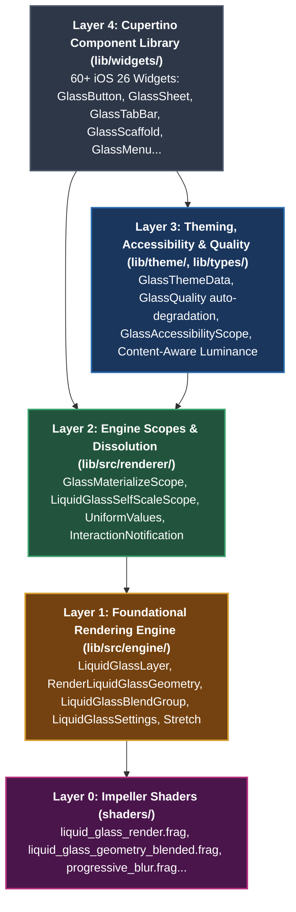

# Architecture & Engineering Design

`liquid_glass_widgets` is a comprehensive, production-grade implementation of the Apple iOS 26 Liquid Glass design system for Flutter. Built on pure Flutter framework primitives with **zero third-party runtime package dependencies**, it combines physical optics shaders, gesture physics, adaptive runtime performance scaling, and a complete suite of 60+ Cupertino components.

---

## High-Level Architecture

The architecture is strictly organized into five decoupled layers:

---

## Architectural Layers

### Layer 0: GPU & Shaders (`shaders/`)
Custom GLSL fragment programs executed directly on Impeller (Metal / Vulkan) and Skia:
* **`liquid_glass_geometry_blended.frag`**: Pre-computes signed distance field (SDF) geometry mattes and encodes true surface normals (V1 encoding) into an offscreen render texture.
* **`liquid_glass_render.frag`**: Reads the geometry texture and applies physical glass refraction, chromatic aberration (RGB channel dispersion), meniscus edge darkening (physical glass thickness), Rec. 709 saturation boost, and luminosity-preserving specular tints.
* **`progressive_blur.frag`**: Multi-tap progressive variable gaussian blur for overlay backdrops.
* **Cross-Platform Shader Portability**: Compiled with explicit `layout(location)` uniform bindings for Impeller and literal array index loop unrolling for strict Windows SkSL / SPIR-V compliance.

### Layer 1: Foundational Rendering Engine (`lib/src/engine/`)
Houses the core rendering engine originally developed by **Tim Lehmann** ([`whynotmake.it`](https://github.com/whynotmake-it)) and licensed under the MIT License:
* **Upstream Baseline**: `liquid_glass_renderer` v0.2.0-dev.4.
* **In-Tree Maintenance & Enhancements**:
  1. **Pure Flutter SDK**: Stripped external dependencies (`flutter_shaders`, `equatable`, `logging`) to ensure zero runtime supply-chain overhead.
  2. **Android Vulkan Compositing Guard**: Fixed race condition during cold boot where initial frames painted prior to compositing bits resolution (`markNeedsCompositingBitsUpdate`).
  3. **Android Warm-up Bounds Protection**: Added bounds validation guards preventing NaN/Infinity crashes on zero-size layout warm-ups.
  4. **Impeller Picture Caching**: Replaced expensive live backdrop passes with hardware-cached `toImageSync` captures.
  5. **Windows SkSL / SPIR-V Compatibility**: Validated via `glslangValidator`.

### Layer 2: First-Party Engine Scopes (`lib/src/renderer/`)
First-party rendering extensions developed specifically for `liquid_glass_widgets`:
* **`GlassMaterializeScope`**: An InheritedWidget that threads dissolution state directly into shader uniforms (`effectiveVisibility`), bypassing Flutter's native `Opacity` layer limitations to prevent Impeller backdrop popping during route transitions.
* **`LiquidGlassSelfScaleScope`**: Coordinates UV coordinate behavior between pushed-back ancestor sheets (which require frozen backdrop UVs) and self-scaled interactive controls (which require live transforms).
* **`UniformValues`**: Sequential float uniform serializer for `ui.FragmentShader`.
* **`interaction_notification.dart`** (`lib/types/`): Implements "Smart Silence", allowing nested interactive children to inform parent sheets/surfaces to suppress surface-level scale or specular effects.

### Layer 3: Theming, Accessibility & Quality Pipeline (`lib/theme/`, `lib/types/`, `lib/utils/`)
* **`GlassThemeData` & `GlassThemeSettings`**: App-wide, cascade-inherited styling system for thickness, blur, specular highlights, tint, and shapes.
* **Adaptive Quality Engine (`GlassQuality`)**:
  - `GlassQuality.premium`: Full Impeller multi-pass refraction, chromatic aberration, and dynamic specular glints.
  - `GlassQuality.standard`: Balanced single-pass refraction and blur.
  - `GlassQuality.economy`: Lightweight blur and rim-lighting.
  - `GlassQuality.flat`: Solid Cupertino fallback for low-power or legacy hardware.
  - Auto-downgrades in real time when frame budget exceedances or thermal throttling are detected.
* **Accessibility Engine (`GlassAccessibilityScope`)**:
  - Automatically queries and respects `MediaQuery.reduceMotionOf(context)`, `highContrast`, and `reduceTransparency`.
* **`GlassSpring` (`lib/utils/glass_spring.dart`)**:
  - Pure Flutter physics implementation adapted from Tim Lehmann's `motor` package (`CupertinoMotion` bouncy, snappy, smooth, interactive presets).

### Layer 4: 60+ iOS 26 Cupertino Glass Components (`lib/widgets/`)
100% first-party Cupertino design system:
* **Interactive Controls**: `GlassButton`, `GlassIconButton`, `GlassChip`, `GlassSwitch`, `GlassSlider`, `GlassSegmentedControl`, `GlassPullDownButton`, `GlassButtonGroup`.
* **Surfaces & Layouts**: `GlassScaffold`, `GlassAppBar`, `GlassTabBar` (bottom, inline, searchable, minimizable), `GlassNavigationShell`, `GlassPinnedBarChrome`.
* **Modals & Overlays**: `GlassDialog`, `GlassSheet`, `GlassModalSheet`, `GlassMenu`, `GlassPopover`.
* **Form Inputs**: `GlassTextField`, `GlassTextArea`, `GlassPasswordField`, `GlassSearchBar`, `GlassPicker`, `GlassFormField`.

---

## Authorship, Attribution & Provenance Standards

To ensure complete transparency, legal clarity, and strict adherence to Google / Flutter open-source third-party standards:

1. **Provenance & Attribution**:
   - All code authored by Tim Lehmann resides exclusively in [`lib/src/engine/`](lib/src/engine/).
   - Tim Lehmann's MIT license is preserved in [`lib/src/engine/LICENSE`](lib/src/engine/LICENSE).
   - An extensive patch log and provenance manifest is maintained in [`lib/src/engine/ATTRIBUTION.md`](lib/src/engine/ATTRIBUTION.md).
2. **Centralized Notices**:
   - Upstream copyrights and licenses for both `liquid_glass_renderer` and `motor` are cataloged in [`THIRD_PARTY_NOTICES`](THIRD_PARTY_NOTICES).
3. **First-Party Code**:
   - All high-level widgets, theming systems, transition scopes, and adaptive degradation algorithms are authored by Sebastian Degenaar for `liquid_glass_widgets` under the MIT License.
